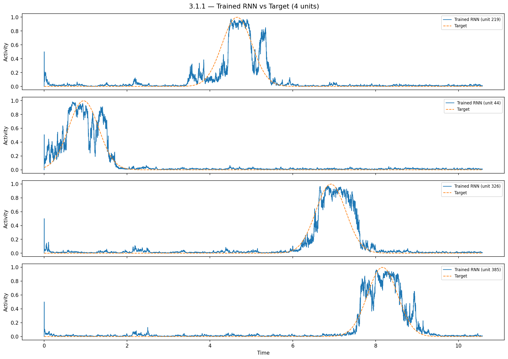
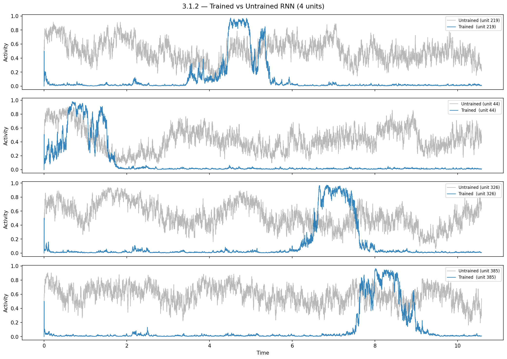
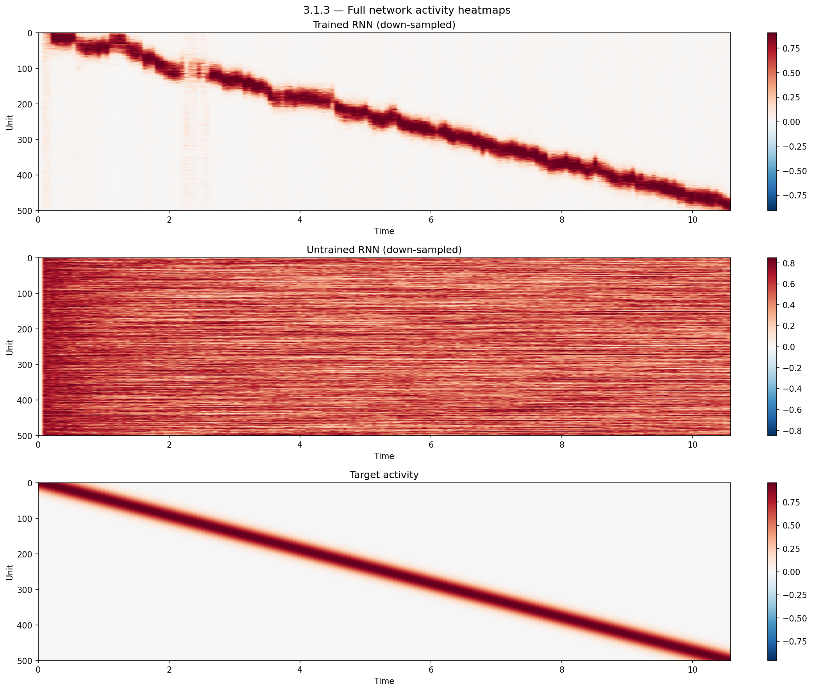
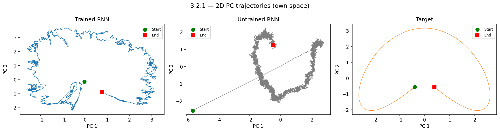
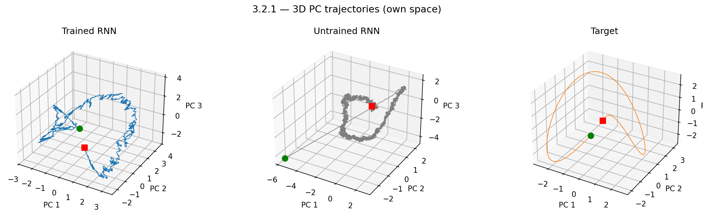
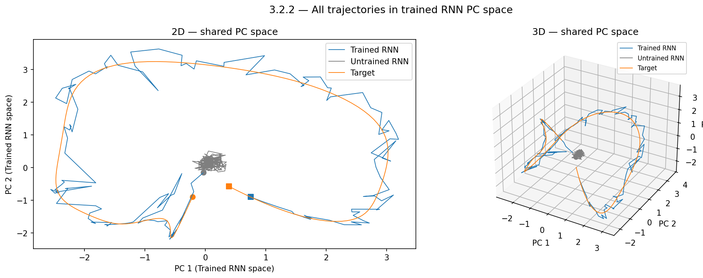
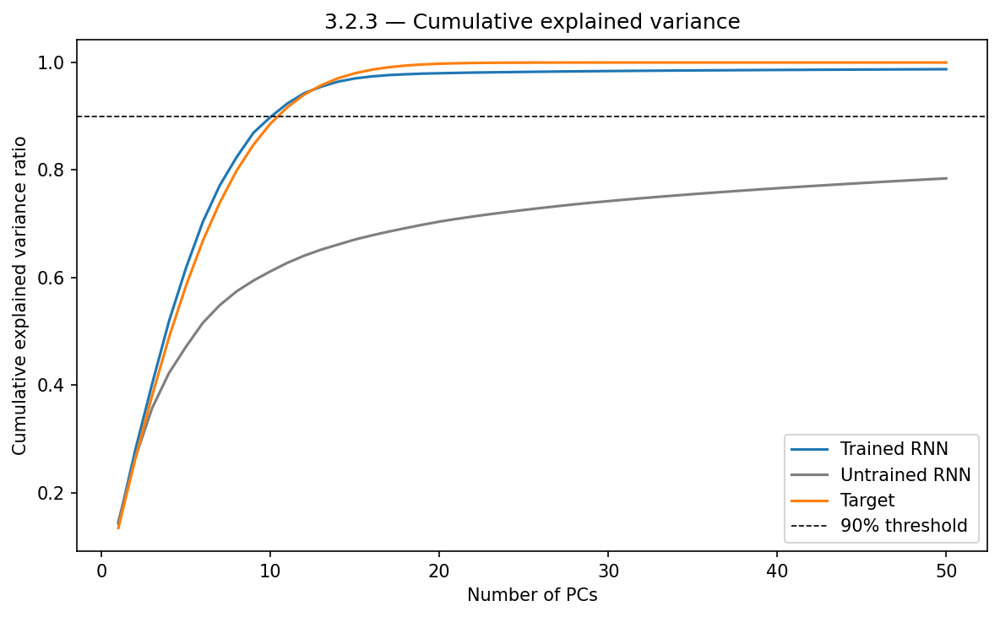
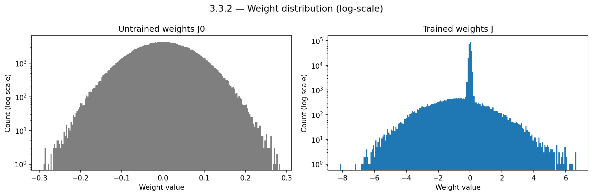
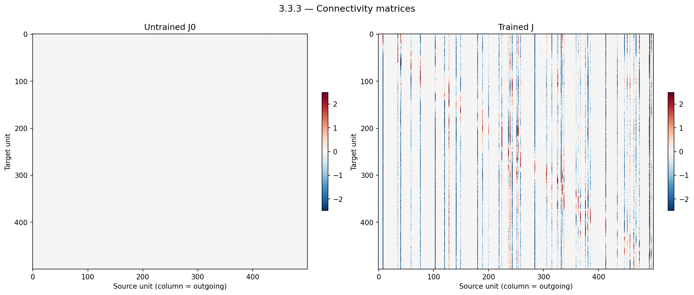
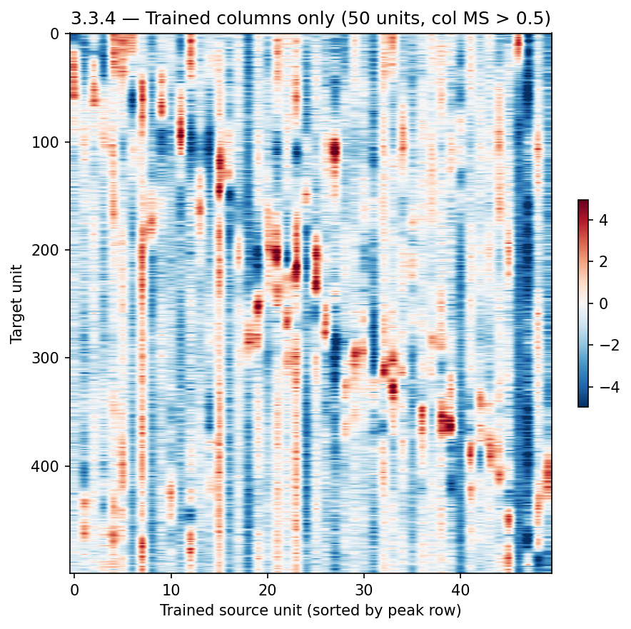

# Exercise 4 — Full-FORCE Learning of Neural Data

---

## 3.1 Activity

### Plots

**Trained RNN vs. target (4 units):**

**Trained RNN vs. untrained RNN (same 4 units):**

**Full-network heatmaps (N=500 units × time):**

### Discussion

**Network activity as a function of time and unit number:**
The heatmaps reveal a clear diagonal stripe of activity that sweeps from unit 0 to unit ~500 as time progresses from 0 to ~11 s. Each neuron fires in a brief, localized burst at a specific time, and the active unit index advances monotonically with time. This is a **sequential "moving bump"** (or "synfire chain") pattern: at any given moment only a narrow band of neurons is active, and that band continuously shifts along the unit axis.

**What does the target neural activity encode?**
The target encodes the **passage of time** through the sequential activation of neurons. Each neuron acts as a "clock hand" that is active for exactly one moment in the sequence. Collectively the population represents time, or equivalently the position along a 1-D trajectory — consistent with the kind of time-coding or sequential memory seen, for example, in hippocampal time cells.

**Do the initial / trained RNNs fit the target well?**
- *Untrained RNN (R0):* No. The heatmap shows uniform, high-amplitude, chaotic activity with no diagonal structure. Individual unit traces (gray) are noisy and non-selective.
- *Trained RNN (R):* Yes, very well. The diagonal stripe in the heatmap closely mirrors the target, and individual unit traces (blue) track the orange target curves with high fidelity, capturing the sharp onset, peak, and offset of each neuron's burst.

---

## 3.2 Dynamics

### Plots

**2D PC trajectories (each dataset projected onto its own PC space):**

**3D PC trajectories (each dataset projected onto its own PC space):**

**All three trajectories projected onto the trained RNN's PC space:**

**Cumulative explained variance:**

### 3.2.1 — Effect of training on the state picture

**How has training changed the state picture?**
Before training, the untrained RNN's state trajectory is a chaotic, space-filling tangle with no clear geometric structure. After training, the trajectory organises into a **ring / near-circular orbit** in PC space: the state smoothly rotates around a fixed center, visiting each point on the ring exactly once over the course of the trial. This is a low-dimensional, ordered limit cycle.

**How does the trained RNN compare to the target?**
The target trajectory (right panel) is a nearly perfect smooth ellipse — the archetype of a ring attractor. The trained RNN's trajectory closely approximates this ellipse, albeit with some roughness from the discrete-time dynamics and residual noise. When all three are projected onto the trained RNN's PC space (shared-space plot), the orange (target) and blue (trained RNN) curves nearly overlap, while the gray (untrained) cloud collapses to a tiny region near the origin, indicating it carries almost no variance along those directions.

### 3.2.3 — Dimensionality and PCs for 90% variance

| Dataset | PCs needed for 90% variance |
|---|---|
| Trained RNN | **11** |
| Target | **11** |
| Untrained RNN | **> 50** (never reaches 90% within 50 PCs) |

**Discussion:**
Training dramatically reduces the effective dimensionality of the network. The untrained RNN is genuinely high-dimensional — its chaotic activity spreads variance almost uniformly across many PCs, consistent with random, unstructured dynamics. After training, the activity collapses onto an approximately **11-dimensional subspace**, matching the intrinsic dimensionality of the target. This makes sense: the moving-bump target is geometrically a smooth ring (1 degree of freedom) embedded in N-dimensional space, but its finite-width bump profile and transients require ~10 additional PCs to be faithfully reproduced. The collapse in dimensionality is a direct consequence of learning — the network has been forced to co-opt only those degrees of freedom needed to represent the ordered sequential code.

---

## 3.3 Connectivity

### 3.3.1 — Magnitude of weight change

| Quantity | Value |
|---|---|
| \|\|J − J₀\|\| | **303.93** |
| \|\|rand₁ − rand₂\|\| (mean ± std, N=50) | **47.43 ± 0.07** |
| Ratio | **6.41×** |

The norm of the trained-vs-initial difference is **6.4× larger** than what is expected from simply drawing two independent random matrices with the same distribution. Training therefore introduced substantial, non-random structure into the connectivity — far beyond the variation attributable to chance.

### 3.3.2 — Weight distribution

**Histograms (log-scale y-axis):**

**Discussion:**
- *J₀ (untrained):* A clean, symmetric Gaussian centered at zero with a narrow range of ~[−0.3, 0.3], as expected from the initialization σ = g/√N ≈ 0.067.
- *J (trained):* The distribution looks like a **mixture of two components**: (1) a very sharp, tall spike at zero — the majority of weights that were not modified during training — and (2) a broad, heavy-tailed distribution extending to ±8, representing weights that were substantially updated. The log-scale makes both components visible simultaneously. This bimodal shape is a signature of sparse, rank-structured learning: most connections remain near their random initial values, while a small fraction carry large learned weights.

### 3.3.3 — Connectivity heatmaps

**Were all units equally trained?**
No. The J₀ heatmap (left) is nearly featureless at the shared color scale — all weights are small and uniform. The J heatmap (right) shows a striking **sparse column structure**: most columns (source units) remain pale / near zero, while a minority of columns contain large positive or negative stripes spanning many target units. This means only a **small subset of source neurons** had their outgoing weights substantially modified by training. The majority of units were left essentially unchanged from their random initialization.

### 3.3.4 — Structure of trained weights

**Number of trained units (column MS > 0.5): 50 / 500 (10%)**

When sorted by peak row, the trained columns reveal a clear **sequential excitatory–inhibitory structure**: each trained source unit has a localized block of large weights (positive or negative) concentrated around a specific row range, and these blocks tile the full unit axis in order as the column index advances. Each trained unit can be thought of as a "relay" or "pacemaker" that:
1. Strongly excites a localized group of target neurons (producing their bump of activity), and
2. Inhibits neighboring groups (suppressing premature or lagging firing).

The sequential tiling of these weight blocks directly implements the moving bump.

### 3.3.5 — How does this connectivity support sequential firing?

The target encodes time as a moving bump of activity that sweeps through the population. The trained connectivity supports this through a **feedforward chain embedded within the recurrent network**:

- Only ~10% of units (50 out of 500) have their outgoing weights substantially modified. These become the "driving" units that shape the dynamics.
- Each such unit has strong, localized connections to the neurons that should fire **next** in the sequence (excitatory to the upcoming group, inhibitory to the current/preceding group).
- This creates a self-sustaining chain reaction: the currently active bump excites the next group while suppressing itself, causing the bump to shift forward in unit space. The pattern then repeats across the full population.
- Because the excitation is local and the inhibition is broad, the bump maintains a roughly constant width and amplitude as it propagates — a hallmark of a "continuous attractor" or ring-lattice dynamics.

In essence, training sculpted a sparse set of highly specific connections that convert the random, chaotic dynamics of the untrained network into a directed, sequential march through the population — a neural implementation of a time-keeper or spatial sequence code.
